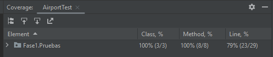
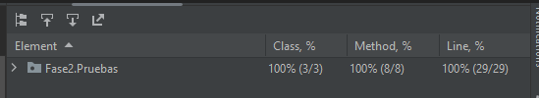
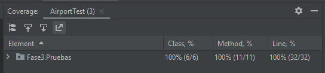
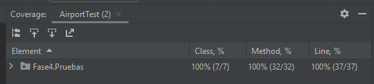
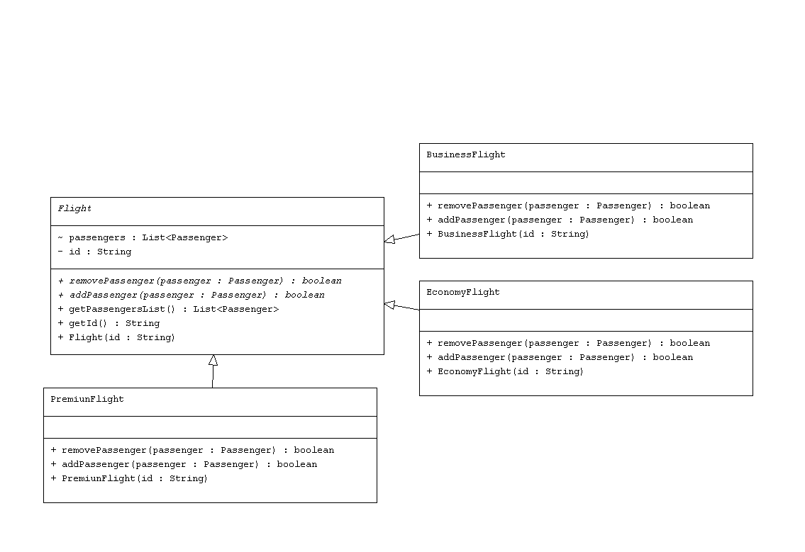
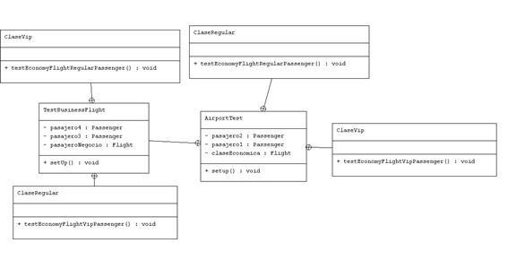

# Segunda Práctica Desarrollo de software
## Respuestas 

### 1. Si ejecutamos las pruebas con cobertura desde IntelliJ IDEA, ¿cuales son los resultados que se muestran?, ¿Por qué crees que la cobertura del código no es del 100%?
Al aplicarle las pruebas de cobertura, podemos observar que para la fase 1

,podemos ver que tenemos cubierto 79% del total del codigo; sin embargo si ejecutamos las pruebas de cobertura para la fase 2

,podemos notar que si se cumple la cobertura al 100 %, de la misma manera
aplicaremos prueba de cobertura en la fase 3 y 4

como notamos las pruebas de cobertura estan que abarcan todo el codigo.

Ahora bien, porqué las pruebas de cobertura de la fase 1, solo abarca un 79%, esto nos indica que hay un 21% de codigo 
que aún no está siendo cubierto por las pruebas unitarias, lo cual debemos tener en cuenta, pues siguiendo la estructura de 
TDD sabemos que una buena practica es empezar a generar pruebas sabiendo si es que funcionará o no, para posteriormente, 
solucionar algunos test que esten teniendo problemas para que así se pueden compilar sin problemas, teniendo en cuenta que los
otros test tambien deben estar funcionando, para finalmente poder optimizar algunos test manteniendo su funcionalidad.

### 2. ¿ Por qué John tiene la necesidad de refactorizar la aplicación?

Para saber el porqué o la necesidad que tiene jhon en refactorizar la apliacación, primero debemos saber en sí, que es la refactorización.
La refactorización es el tercer paso de la estructura de TDD, en la cual optimizamos los códigos de los test, asegurando su funcionalidad, para
así poder tener un código limpio, funcional y altamente reutilizable.
Por estas razones Jhon debería refactorizar su código, pues al pasarle por prueba de cobertura puede notar que en la primera fase
hay 21% del código que aún no tiene pruebas unitarias, tambien al refactorizar puede darse cuenta si estan existiendo elementos que no 
se estan utilizando para así depurarlos, en resumen refactorizar un proyecto, aplicar la técnica TDD, permite a un desarrollador 
tener confianza en su trabajo, pues sabemos que al final tendremos como ya mencionado anteriormente, un producto, limpio, funcional
y altamente reutilizable, que es un resultado de utilizar y tener conocimiento de las buenas prácticas de la programación. 

### 3. La refactorización y los cambios de la API se propagan a las pruebas.
- Diagrama de clases de la fase tres:
En la fase tres como podemos notar consta de una serie de clases y métodos de herencia y interfaz.

- Diagrama de clases de los test de la fase 3:
En el diagrama  de clases se muestra la relación entre las clases y las pruebas que estamos realizando para ver el funcionamiento de cada una de los métodos  con cada uno de los dos tipos de clases  de ticket o viajes.

##### ¿Cuál es la cobertura del código?
En esta fase  en el script de testAiroport, verificamos los dos métodos  que se encuentran  en el script Flight que son los métodos de eliminar y agregar pasajeros.
Por este motivo lo que se hace  es realizar las pruebas  de los dos tipos de vuelos que hasta el momento tenemos que son Clase Económica y la clase de Negocios.
Estas clases son probadas con  los dos tipos de pasajeros que tenemos que  los vip y los no vip.

##### ¿ La refactorización de la aplicación TDD ayudó tanto a mejorar la calidad del código?
La refactorización de la aplicación  básicamente nos permitió realizar iteraciones cortas y rápidas. Dado que aplicamos el concepto de divide y vencerás, al realizar  las pruebas de calidad.
Con la refactorización hemos optimizado el código del test y de esta manera aseguramos la funcionalidad.

### 4. ¿En qué consiste la regla rule of three relacionada a la refactorización?
- The rule of three  es una regla general de refactorización de código.
- La idea básica de la refactorización de tres es que siempre que tengamos alguna duplicación necesitamos asegurarnos  de que realmente necesita ser extraída a veces dado que podemos cometer errores porque extraemos la posible duplicación demasiado pronto.

- Lo que se busca con la regla de tres es tener una especie de guía que te diga que si existe código que se repite tres veces y que necesitas eliminar alguno de ellos y minimizar a duplicación, en ocasiones que se repita tres a veces  no es suficiente 

### 5. Escribe el diseño inicial de la clase llamada PremiumFlight y agrega a la Fase 4 en la carpeta producción.
Implementado directamente en el código

### 6. Ayuda a John e implementa las pruebas de acuerdo con la lógica comercial de vuelos premium de las figuras anteriores. Adjunta tu código en la parte que se indica en el código de la Fase 4. Después de escribir las pruebas, John las ejecuta
Implementado directamente en el codigo

### 7. Agrega la lógica comercial solo para pasajeros VIP en la clase PremiumFlight. Guarda ese archivo en la carpeta Producción de la Fase 5.

### 8. Ayuda a John a crear una nueva prueba para verificar que un pasajero solo se puede agregar una vez a un vuelo. La ejecución de las pruebas ahora es exitosa, con una cobertura de código del 100 %. John ha implementado esta nueva característica en estilo TDD.
